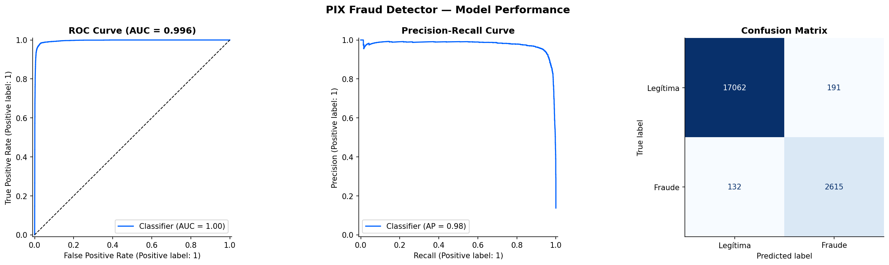
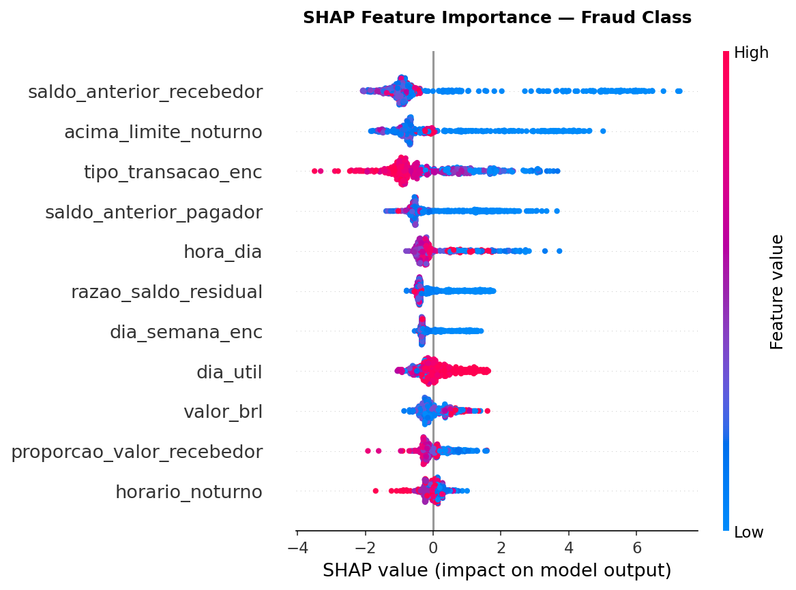

# PIX Fraud Intelligence
### End-to-end fraud detection on IBM's enterprise AI stack


---

## Business Problem

**PIX**, Brazil's instant payment system operated by Banco Central do Brasil, processed over **63.8 billion transactions in 2024** — surpassing the combined volume of credit cards, debit cards, boleto, and TED. With this growth came a surge in fraud targeting individual account holders through social engineering attacks and account takeovers.

Financial institutions face a dual challenge:

1. **Detect fraud in real time** without blocking legitimate transactions
2. **Explain decisions** to regulators and customers — mandatory under [LGPD Art. 20](https://www.planalto.gov.br/ccivil_03/_ato2015-2018/2018/lei/l13709.htm)

IBM's banking clients — including major Brazilian institutions — face exactly this challenge. This project demonstrates how IBM's enterprise AI stack solves it end-to-end, using a purpose-built PIX fraud dataset as the data source.

---

## Dataset

This project uses **[PIX Fraud BR](https://huggingface.co/datasets/andremessina/pix-fraud-br)** — a synthetic dataset of 2 million PIX P2P transactions designed specifically for this problem, published on Hugging Face.

> Built as a companion project: PaySim's mobile money simulator was adapted to reflect Brazil's official PIX transaction modalities (BCB Manual de Padrões v2.9.0), regulatory rules, and real-world fraud patterns documented by Febraban. Balance columns were regenerated synthetically to enforce PIX atomicity guarantees. See the [dataset card](https://huggingface.co/datasets/andremessina/pix-fraud-br) for full methodology.

| | |
|---|---|
| **Rows** | 2,000,000 |
| **Fraud rate** | 0.77% (15,376 cases) |
| **Features** | 17 |
| **Key fraud signals** | `razao_saldo_residual`, `saldo_anterior_recebedor` |
| **Validated baseline** | XGBoost ROC-AUC 0.995 / PR-AUC 0.865 |

---

## Solution Architecture

```
  ┌─────────────────────┐
  │   PIX Fraud BR      │
  │   HuggingFace       │   load_dataset("andremessina/pix-fraud-br")
  │   2M transactions   │
  └──────────┬──────────┘
             │
             ▼
┌────────────────────────────────────────────────────────────────────┐
│                       IBM Cloud (Free Tier)                         │
│                                                                      │
│  ┌─────────────────┐   ┌──────────────────┐   ┌────────────────┐   │
│  │  Db2 on IBM     │◄──│  watsonx.ai      │──►│ watsonx.ai     │   │
│  │  Cloud Lite     │   │  Studio Lite     │   │ AutoAI         │   │
│  │ (Feature Store) │   │ (EDA + Notebooks)│   │ (AutoML)       │   │
│  └─────────────────┘   └──────────────────┘   └───────┬────────┘   │
│                                                        │            │
│                                               ┌────────▼─────────┐  │
│                                               │ watsonx.ai       │  │
│                                               │ Runtime Lite     │  │
│                                               │ (REST Endpoint)  │  │
│                                               └──────────────────┘  │
└────────────────────────────────────────────────────────────────────┘
                                                        │
                                               SHAP Explainability
                                               (LGPD Art. 20)
```

---

## IBM Technologies Used

| Technology | Role | Tier |
|---|---|---|
| [Db2 on IBM Cloud](https://www.ibm.com/products/db2-database) | Feature store — 100k transactions, single source of truth | Lite (free) |
| [watsonx.ai Studio](https://www.ibm.com/products/watson-studio) | Jupyter notebooks — EDA, feature engineering, evaluation | Lite (free) |
| [watsonx.ai AutoAI](https://www.ibm.com/products/watsonx-ai) | Automated ML — pipeline search, HPO, model selection | Lite (free) |
| [watsonx.ai Runtime](https://cloud.ibm.com/catalog/services/watsonxai-runtime) | Online model deployment — REST scoring endpoint | Lite (free) |
| [IBM Cloud Object Storage](https://www.ibm.com/products/cloud-object-storage) | Training data asset storage for AutoAI | Lite (free) |

---

## Key Results

End-to-end run on **15 Jun 2026**. AutoAI evaluated 15 pipelines across XGBoost, LightGBM, and Random Forest; the best pipeline (**Pipeline 9 — LightGBM** with feature engineering + two rounds of HPO) was deployed to a watsonx.ai Runtime online endpoint. Metrics below are computed on the **held-out test set (20,000 transactions, 13.7% fraud)** scored through the deployed REST endpoint.

| Metric | Value |
|---|---|
| ROC-AUC | **0.9962** |
| F1 Score (fraud class) | **0.9418** |
| Precision (fraud class) | **0.9319** |
| Recall (fraud class) | **0.9519** |

**Confusion matrix (test set):**

| | Predicted Legit | Predicted Fraud |
|---|---|---|
| **Actual Legit** | 17,062 (TN) | 191 (FP) |
| **Actual Fraud** | 132 (FN) | 2,615 (TP) |

The model catches **95.2% of fraud** (2,615 / 2,747) while keeping false positives to **1.1%** of legitimate transactions (191 / 17,253) — the precision/recall balance that matters when blocking a legitimate PIX transfer carries real customer cost.

**AutoAI pipeline leaderboard (top 5 by holdout F1):**

| Pipeline | Estimator | Enhancements | Holdout ROC-AUC | Holdout Avg. Precision |
|---|---|---|---|---|
| Pipeline 9 | LightGBM | HPO + FE + HPO | 0.9991 | 1.0000 |
| Pipeline 10 | LightGBM (ensemble) | HPO + FE + HPO + Ensemble | 0.9991 | 1.0000 |
| Pipeline 8 | LightGBM | HPO + FE | 0.9991 | 1.0000 |
| Pipeline 5 | XGBoost (ensemble) | HPO + FE + HPO + Ensemble | 0.9991 | 1.0000 |
| Pipeline 7 | LightGBM | HPO | 0.9991 | 1.0000 |



### SHAP Feature Importance

SHAP (TreeExplainer) attribution over a 500-transaction sample of the test set. `saldo_anterior_recebedor` (the receiver's pre-existing balance) is the single strongest signal — consistent with the mule-account pattern where fraud destinations hold near-empty balances.

| Feature | Mean \|SHAP\| share |
|---|---|
| `saldo_anterior_recebedor` | 21.9% |
| `acima_limite_noturno` | 15.5% |
| `tipo_transacao_enc` | 14.4% |
| `saldo_anterior_pagador` | 11.4% |
| `hora_dia` | 7.3% |
| `razao_saldo_residual` | 7.2% |



---

## Project Structure

```
ibm-pix-fraud-detection/
├── notebooks/
│   ├── 01_eda.ipynb                   # Load from HuggingFace, EDA, sample 100k rows
│   ├── 02_feature_engineering.ipynb   # Encode categoricals, SMOTE, train/test split
│   ├── 03_db2_ingestion.ipynb         # Ingest processed data to Db2 Lite
│   ├── 04_autoai_experiment.ipynb     # Run AutoAI, deploy best pipeline to WML
│   └── 05_model_evaluation.ipynb      # Score via REST, compute metrics, SHAP
├── src/
│   ├── db2_connector.py               # ibm_db connection utility + batch insert
│   └── wml_scorer.py                  # WML REST endpoint scoring client
├── config/
│   ├── credentials_template.json      # Template — copy to credentials.json
│   ├── credentials.json               # IBM Cloud credentials (gitignored)
│   ├── le_tipo.pkl                    # LabelEncoder for tipo_transacao (generated by 02)
│   ├── le_dia.pkl                     # LabelEncoder for dia_semana (generated by 02)
│   ├── deployment_meta.json           # WML model/deployment UIDs (generated by 04)
│   └── results.json                   # Final model metrics (generated by 05)
├── assets/                            # Visualizations generated by notebooks
├── requirements.txt
└── .gitignore
```

---

## How to Run

### Prerequisites
- Python 3.11+
- [IBM Cloud account](https://cloud.ibm.com/registration) (free)
- [Hugging Face account](https://huggingface.co/join) (free)

### 1. IBM Cloud Setup

Provision the following services on **Lite / free tier**:

1. **Db2 on IBM Cloud** — [Create instance](https://cloud.ibm.com/catalog/services/db2)
2. **watsonx.ai Studio** — [Create instance](https://cloud.ibm.com/catalog/services/watsonxai-studio)
3. **watsonx.ai Runtime** — [Create instance](https://cloud.ibm.com/catalog/services/watsonxai-runtime)
4. **Cloud Object Storage** — [Create instance](https://cloud.ibm.com/catalog/services/cloud-object-storage)

After provisioning, create a Deployment Space in [dataplatform.cloud.ibm.com](https://dataplatform.cloud.ibm.com) associating the Runtime and COS instances, then fill in your credentials:

```bash
cp config/credentials_template.json config/credentials.json
# Edit config/credentials.json with your IBM Cloud service credentials
```

### 2. Install Dependencies

```bash
pip install -r requirements.txt
```

> **Note on `ibm_db`:** Requires IBM Data Server Driver. On Windows, install from  
> [IBM Data Server Driver — Getting Started](https://www.ibm.com/support/pages/getting-started-ibm-data-server-drivers) before running pip install.

### 3. Run Notebooks in Order

The dataset is loaded automatically from Hugging Face in notebook 01 — no manual download needed.

```bash
jupyter notebook
```

| Notebook | What it does | Est. Time |
|---|---|---|
| `01_eda.ipynb` | Load PIX Fraud BR, sample 100k, EDA visualizations | 3 min |
| `02_feature_engineering.ipynb` | Encode features, split train/test, SMOTE | 3 min |
| `03_db2_ingestion.ipynb` | Create TRANSACTIONS table and ingest to Db2 | 10 min |
| `04_autoai_experiment.ipynb` | Run AutoAI experiment, deploy model to WML | **15–30 min** |
| `05_model_evaluation.ipynb` | Score test set, compute metrics, SHAP | 5 min |

---

## LGPD Compliance Note

Under **LGPD Art. 20**, automated decisions that affect data subjects must be explainable upon request. This project uses **SHAP (SHapley Additive exPlanations)** to generate per-transaction, per-feature attribution scores — enabling a compliance response of the form:

> *"This transaction was flagged because: the sender's remaining balance ratio was 0.04 (emptied 96% of account — contribution: +0.61), the receiver had an unusually low pre-existing balance of R$312 consistent with a mule account (contribution: +0.28), and the transfer occurred during the BCB night period above the R$1,000 threshold (contribution: +0.09)."*

---

## Author

**André Messina** — Data Scientist  
Portfolio project demonstrating IBM enterprise AI stack proficiency for PIX fraud detection.

- Dataset: [huggingface.co/datasets/andremessina/pix-fraud-br](https://huggingface.co/datasets/andremessina/pix-fraud-br)
- IBM analysis: [github.com/devdebdeb/ibm-pix-fraud-detection](https://github.com/devdebdeb/ibm-pix-fraud-detection)
